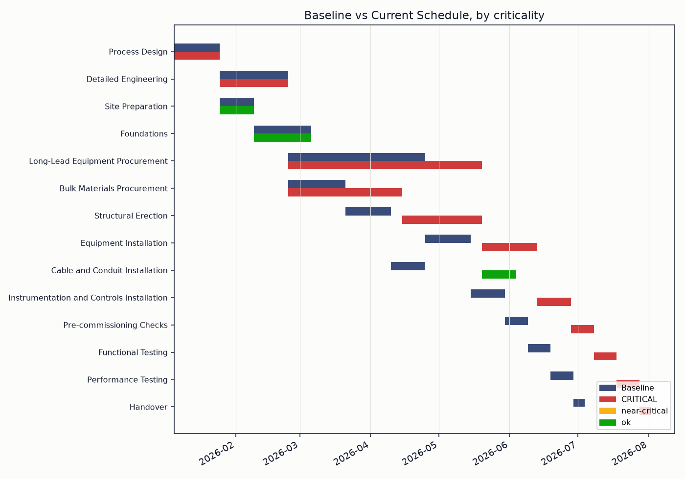
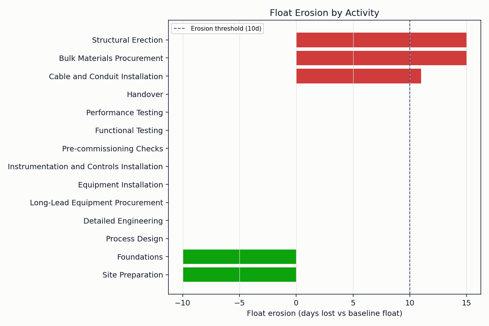

# Schedule Health Analyzer

 [](https://codecov.io/gh/alexc-hue/schedule-health-analyzer) [](LICENSE) 

Operationalizes the Critical Path Method as a repeatable health check instead
of a one-off Gantt review. Runs a project's activity network twice, once
against baseline durations, once against current/re-estimated ones, and turns
the comparison into a schedule health report: forecast slip, float erosion by
activity, critical-path concentration, and a composite 0-100 health score.

Part of a small project-controls toolkit:
[project-controls-dashboard](https://github.com/alexc-hue/project-controls-dashboard),
**schedule-health-analyzer** (this repo),
[change-control-register](https://github.com/alexc-hue/change-control-register),
[risk-trend-tracker](https://github.com/alexc-hue/risk-trend-tracker),
[project-controls-reporting-engine](https://github.com/alexc-hue/project-controls-reporting-engine).



## Problem

"Is the schedule actually healthy, or just not late yet?" is hard to answer
from a Gantt chart alone. A schedule can look fine while its float is quietly
disappearing, activities that had weeks of slack six months ago are now one
bad week from the critical path, and nobody notices until they cross zero.
This tool automates the check: point it at an activity list with baseline and
current durations, and it recomputes the network twice and shows exactly
where the buffer went.

## Approach

- Model the project as an activity network (duration + predecessors) and run
  a standard forward/backward pass CPM twice, once on baseline durations,
  once on current ones, to get early/late dates and total float for every
  activity under both.
- Compare the two: forecast slip at the project level, float erosion per
  activity (baseline float minus current float), and which activities have
  crossed into critical (float <= 0) or near-critical (float <= 5 days).
  These are the same CPM primitives, float and critical path, that
  standards like the DCMA 14-Point Assessment also check; this tool doesn't
  implement that full checklist (no logic-error or missing-predecessor
  detection), just the slip/erosion/concentration slice of it.
- Roll that into one Schedule Health Score: 50 points for how much the
  finish date has slipped, 25 for how much of the network has lost
  meaningful float, 25 for how concentrated the critical path has become.
  Each component is a simple, stated formula, not a black box.

The sample data is a fictional 14-activity infrastructure project (process
design through commissioning) where a long-lead procurement delay and a
secondary materials/construction delay converge onto the same critical
window, chosen so the tool has a real "two paths going critical at once"
case to detect, not just a single obvious late task.

## Implementation

Built in Python so the Critical Path Method runs the same way every time
instead of being re-derived by eye off a Gantt chart: pandas for the data and
CPM bookkeeping, matplotlib for the charts. No external scheduling libraries,
the CPM forward/backward pass is implemented directly (see `src/cpm.py`).

## Result

```
SCHEDULE HEALTH REPORT
================================================================
Schedule Health Score: 31.5 / 100
  - Slip component:          6.5 / 50
  - Float erosion component: 19.6 / 25
  - Critical concentration:  5.4 / 25

Baseline finish:  2026-07-04
Current forecast: 2026-08-02  (+29 days)
Activities with eroded float (>= 10d lost): 21.4%
Activities critical or near-critical: 78.6%
```

Plus the current critical path activity by activity, and the activities that
lost the most float, ranked, with the newly-critical ones flagged.

A saved copy of this report is generated alongside the charts: see
[assets/report.md](assets/report.md).

## Screenshots

**Baseline vs. current schedule**, colored by current criticality. Two
activities (Bulk Materials Procurement, Structural Erection) that had slack
at baseline have converged onto the critical path in the current schedule.


**Float erosion by activity** — how much baseline float each activity has
lost (or, for early activities finishing well ahead of the new critical
path, gained).



## Limitations

- Calendar-day durations, not a resourced or calendared schedule (no
  weekends/holidays, no resource contention modeling). Fine for a portfolio-
  scale demonstration, not a substitute for a scheduling tool like Primavera
  P6 on a real programme.
- `current_duration_days` is a single re-estimated total duration per
  activity, not a remaining-duration calculation derived from percent
  complete. A production version would need to distinguish "how long this
  took" from "how long is left."
- No resource leveling or logic-anomaly detection (missing predecessors,
  unusually long activities). The score only covers slip, float erosion,
  and critical-path concentration, deliberately, to keep every component
  explainable in one sentence.
- Meant to sit alongside a client's scheduling tool of record (Primavera P6,
  MS Project), reading the baseline and current dates it already maintains,
  not replacing it. The tool also doesn't decide what to do about a
  near-critical activity, flagging it and leaving the response to the
  planner or PM stays deliberate.

## What I learned

The interesting failure mode isn't a single late activity, it's two
independently-slack chains converging onto the same critical window at the
same time, which is exactly the kind of thing that's easy to miss scanning a
Gantt chart by eye and easy to catch by just re-running the network. Keeping
the health score to three plainly-stated components (slip, erosion,
concentration) rather than folding in more signals was a deliberate choice:
a score a project sponsor can't have explained back to them in one sentence
isn't actually useful in a status meeting.

## Run it

```bash
pip install -r requirements.txt
python analyzer.py
```

Swap in your own `data/activities.csv` (same columns: `activity_id`,
`activity_name`, `phase`, `predecessors` as semicolon-separated ids,
`baseline_duration_days`, `current_duration_days`, `status`,
`percent_complete`) to point it at a real schedule. The `PROJECT_START`
constant near the top of `analyzer.py` is this fictional schedule's own
assumption too, not read from the CSV, so update it by hand as well.
